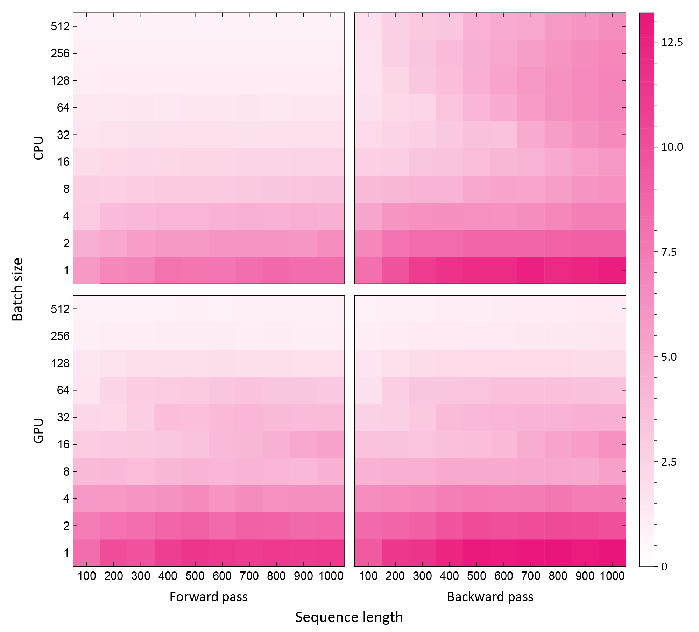

# pNeRF: Parallelized Natural Extension Reference Frame

pNeRF is a parallelized extension of the widely used NeRF method for converting the parameterization of polymers, typically proteins, from internal (bond lengths, angles, and torsions) to Cartesian coordinates. pNeRF is parallelized even for individual polymers, achieving much higher utilization of modern CPUs and GPUs, and is suitable for use in machine learning applications in which gradients are backpropagated through the NeRF equations.

This is a TensorFlow implementation of pNeRF. Using this implementation we observe speed ups of up to 13x on CPUs (Xeon E5-2643 v4) and GPUs (Titan Xp):

Color intensity corresponds to fold speed up.

### Citation
Please cite the forthcoming preprint on pNeRF when it becomes available.
